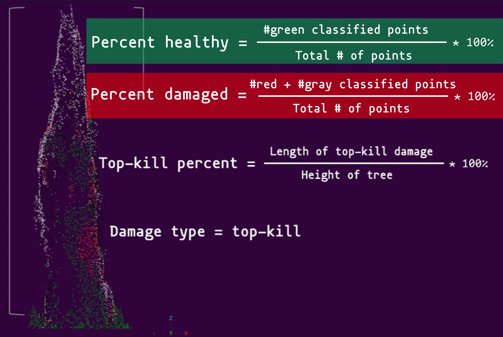

### Combining Multispectral and Three-Dimensional Data From Drone Imagery to Detect Forest Insect Damage: An Evaluation of a Novel Approach to Identify the Vertical Structure of Damage in Trees in the Northern Rocky Mountains, USA

Project description: My M.S. research project focused on evaluating methods of detecting forest insect damage and mortality using Unmanned Aerial Systems (UAS)-derived data products in conifer forests of the western United States. The project explored the utlity of point cloud data derived from Structure for Motion (SfM) for the classification and characterization of vertical tree damage of a UAS mission area. I used tools such as ArcGIS Pro, Agisoft Metashape, CloudCompare, and R and Python programming to create new algorithms and establish a novel methodology.   

<b>The research for this project was conducted in the ancestral homelands of the Ksanka (Kootenai), Ql̓ispé (Pend d’Oreille), and Sélish (Salish) tribes of western Montana.</b>

Drone data used for this MS thesis was collected for a broader project assessing tree damage funded by the NASA Commercial SmallSat Data Acquisition Program (NASA CSDA, award #80NSSC21K115) (*see details in the ['Research Portfolio'](/portfolio/) page*).  

## Journal article

### *Evaluating a Novel Approach to Detect the Vertical Structure of Insect Damage in Trees Using Multispectral and Three-Dimensional Data from Drone Imagery in the Northern Rocky Mountains, USA.* 

 Graphical abstract
  

<h2 id="PotreeViewer">Potree Point Cloud Viewer</h2>

* The current scene is only rendering the RGB point cloud.  
* Navigate to *Scene* > *Objects* > *Point Clouds* to toggle the visibility of the random forest (RF) classified point cloud and point cloud with classification probability.
* RF classes: green is healthy, red is red, gray is gray, and black is shadow.
* RF probability: warmer color (orange-red) higher classification probability, cooler color (yellow-blue) lower classification probability.
* Navigate to *Scene* > *Objects* > *Other* to toggle the visibility of the tree crown outlines from the point cloud segmentation of individual trees. The color of the tree crown outlines follow the following color scheme: Healthy (forest green), Minor damage (faded orange), Moderate damage (vibrant orange), Major damage (vibrant red), NA (black).
* Double-click on the annotations (e.g., "Top-killed tree") to zoom to the tree.

>To open the Potree viewer in a new tab (full-screen), click <a href="/files/potree/MSThesis_PotreeScenes/MSThesis_RFClass/MSThesisRFClass.html" target="_blank">here</a>.

		<iframe src="/files/potree/MSThesis_PotreeScenes/MSThesis_RFClass/MSThesisRFClass.html" width="50%" height="600" style="flex: 1;"></iframe>

  

## Top-kill detection and assessment algorithms

There are two top-kill algorithms implemented for this project: `top2bin` and `bin2bin`. Both algorithms begin at the top of the tree and progresses downward. Details for the each algorithm are as follows:

| top2bin    | bin2bin |
| :------: | :------: |
|The `top2bin` algorithm assesses the percentage of damage points within a set of height bins from the top of the tree to a given height. | The `bin2bin` algorithm assesses the percentage of damage points for each height bin beginning at the top of the tree and progressing downward.  |
|  |   |

### Interactive preview of top-kill detection algorithm on the point cloud of a single tree

> *Use the left mouse button to tilt the 3D model and the mouse scroll wheel to zoom in and out.* 

True-color render, random forest classification of point cloud and top-kill algorithm

  <iframe src="/files/potree/MSThesis_PotreeScenes/IndividualTree_RGB/IndividualTree_RGB.html" width="50%" height="600" style="flex: 1;"></iframe>

> **Left panel:** True color representation of the point cloud. **Right panel:** RF classification; green is healthy, red is red, gray is gray, and black is shadow.Top-kill algorithm applied to point cloud, red plane represents the height of top-kill detected by the algorithm.

### Summary of tree damage metrics:  

## Presentations

*I presented a condensed version of my MS research for University of Idaho's [GIS day 2023](https://www.lib.uidaho.edu/gisday/) as a contributed talk.* 
> To view the recording of the presentation, please follow this link: 
<iframe width="560" height="315" src="https://www.youtube.com/embed/71AH3u_J9tQ?si=jxqHy1cbKtSn7eFY" title="YouTube video player" frameborder="0" allow="accelerometer; autoplay; clipboard-write; encrypted-media; gyroscope; picture-in-picture; web-share" allowfullscreen></iframe>

> To view the pdf of the presentation file, please follow this link: <a href="https://objects.lib.uidaho.edu/gisday/shrestha_gisday2023.pdf" target = "_blank">https://objects.lib.uidaho.edu/gisday/shrestha_gisday2023.pdf</a>

 Code outlining the methodology for the project are available as a GitHub repository. Link to the code repository can be found in the <a href="/publications/#GitHubRepositories">Publications and Repositories</a> page 

